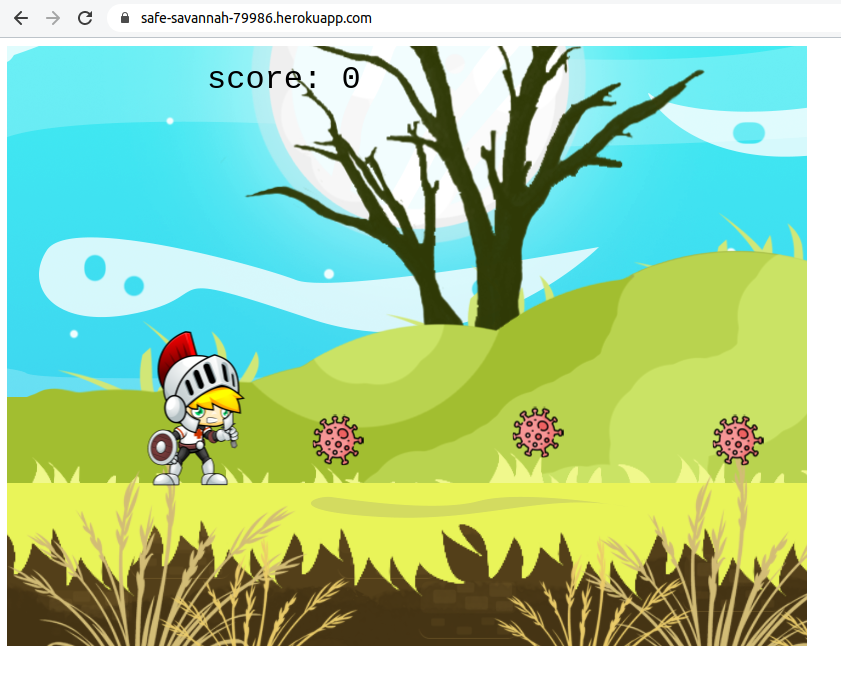

# Shooter Game
  Simple shooter game yet the idea is unique, and its implemented using Phaser.

## Built With

- React JS
- Phaser 3
- Webpack

## Live Link

[Shooter Game](https://safe-savannah-79986.herokuapp.com/)

### Prerequisites

- Any kind of browser supporting CSS3 and HTML5

### Setup

- Fork the repo to your remote repository.
- Clone or download the repository to your local machine.

### Install

- clone the project
- switch to project folder [ `cd shooter_game` ]
- install reqired project using npm [`npm install`] 
- start editing js files in `src` directory
- Use  `npm run build` to run webpack and build files
- Start the Server using `npm start` to play the game

### Usage

- Visit the live demo link on your web browser.

## Author

👤 **Karthick Venkatesan**

- [Portfolio](https://karthi07.github.io/)
- [LinkedIn](https://www.linkedin.com/in/karthickvenkadesan/)
- [GitHub](https://github.com/karthi07)
- [E-mail](itkarthi02@gmail.com)

## 🤝 Contributing

Contributions, issues and feature requests are welcome!

Feel free to check the [issues page](https://github.com/karthi07/shooter_game/issues).

## Show your support

Give a ⭐️ if you like this project!
